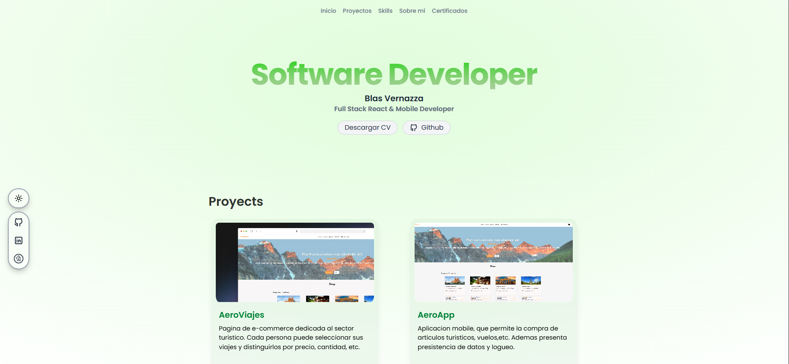

# 👨🏻‍💻 Porfolio para programadores y desarrolladores

<div align="center">
<a href="https://porfolio.dev/">

</a>
<p>
  
  
  
  
</p>
</div>

## 📝 Descripción

Un portafolio moderno y profesional construido con Astro, diseñado para desarrolladores que buscan mostrar su trabajo y habilidades de manera efectiva. Este proyecto ofrece una base sólida y personalizable para crear tu presencia en línea como desarrollador.

## ✨ Características

- 🚀 Construido con Astro para máximo rendimiento
- 🎨 Estilizado con Tailwind CSS
- 📱 Diseño responsive y adaptable
- 🔍 Optimizado para SEO con astro-robots-txt
- 🎯 Tipografía moderna con Onest Variable Font
- 📦 TypeScript para un desarrollo más seguro
- 🏗️ Estructura modular y mantenible

## 🛠️ Tecnologías

- [Astro](https://astro.build/) - Framework web moderno
- [Tailwind CSS](https://tailwindcss.com/) - Framework CSS
- [TypeScript](https://www.typescriptlang.org/) - Superset de JavaScript
- [Onest Variable Font](https://github.com/atelier-anchor/smiley-sans) - Fuente tipográfica moderna

## 🚀 Cómo Comenzar

1. Clona el repositorio:
```bash
git clone https://github.com/BlasVernazza06/My-Portfolio.git
```

2. Instala las dependencias:
```bash
pnpm install
```

3. Inicia el servidor de desarrollo:
```bash
pnpm dev
```

4. Abre [http://localhost:4321](http://localhost:4321) en tu navegador.

## 📦 Estructura del Proyecto

```
src/
├── assets/      # Recursos estáticos
├── components/  # Componentes reutilizables
├── content/     # Contenido del sitio
├── layouts/     # Plantillas de diseño
└── pages/       # Páginas de la aplicación
```

## 📄 Licencia

Este proyecto está bajo la Licencia MIT - ver el archivo [LICENSE.md](LICENSE.md) para más detalles.

## 🤝 Contribuciones

Las contribuciones son bienvenidas. Por favor, abre un issue primero para discutir los cambios que te gustaría hacer.

## 📬 Contacto

Si tienes alguna pregunta o sugerencia, no dudes en contactarme a través de:
- Email: [blasvernazza123@gmail.com](mailto:blasvernazza123@gmail.com)
- GitHub: [@BlasVernazza06](https://github.com/BlasVernazza06)

